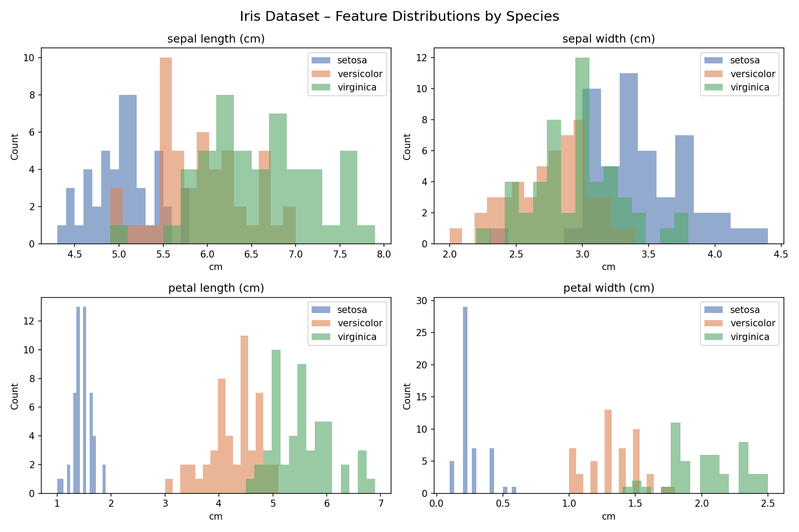

# 🌸 Iris Flower Classifier

A beginner-friendly Machine Learning project that classifies iris flowers into three species — **Setosa**, **Versicolor**, and **Virginica** — based on their physical measurements.

---

## 📌 About the Project

The [Iris dataset](https://archive.ics.uci.edu/ml/datasets/iris) is one of the most well-known datasets in ML. Each flower is described by 4 features:

| Feature | Description |
|---|---|
| Sepal Length | Length of the sepal (cm) |
| Sepal Width | Width of the sepal (cm) |
| Petal Length | Length of the petal (cm) |
| Petal Width | Width of the petal (cm) |

The goal is to predict which of the **3 species** a flower belongs to.

---

## 🧠 Algorithm Used

**K-Nearest Neighbors (KNN)**  
A simple but effective algorithm that classifies a new data point by looking at the *k* closest points in the training set and taking a majority vote.

---

## 📊 Results

| Metric | Score |
|---|---|
| Accuracy | **96.67%** |
| Precision | 97% (avg) |
| Recall | 97% (avg) |

### Confusion Matrix


### Feature Distributions


### Correlation Heatmap


---

## 🛠️ Tech Stack

- **Python 3.x**
- `scikit-learn` — ML model and preprocessing
- `pandas` — data manipulation
- `matplotlib` & `seaborn` — data visualization

---

## 🚀 How to Run

1. **Clone the repository**
   ```bash
   git clone https://github.com/YOUR_USERNAME/iris-flower-classifier.git
   cd iris-flower-classifier
   ```

2. **Install dependencies**
   ```bash
   pip install -r requirements.txt
   ```

3. **Run the script**
   ```bash
   python iris_classifier.py
   ```

---

## 📁 Project Structure

```
iris-flower-classifier/
│
├── iris_classifier.py      ← Main script (EDA + training + evaluation)
├── requirements.txt        ← Python dependencies
├── eda_distributions.png   ← Feature distribution plots (auto-generated)
├── eda_correlation.png     ← Correlation heatmap (auto-generated)
├── confusion_matrix.png    ← Model evaluation plot (auto-generated)
└── README.md               ← You are here
```

---

## 📖 What I Learned

- Loading and exploring a real dataset with **pandas**
- Visualizing data distributions and correlations with **matplotlib/seaborn**
- Splitting data into train/test sets
- Feature scaling with `StandardScaler`
- Training and evaluating a **KNN classifier**
- Reading a **classification report** and **confusion matrix**

---

## 📬 Connect

Feel free to reach out or connect with me on [LinkedIn](https://linkedin.com/in/YOUR_PROFILE)!
